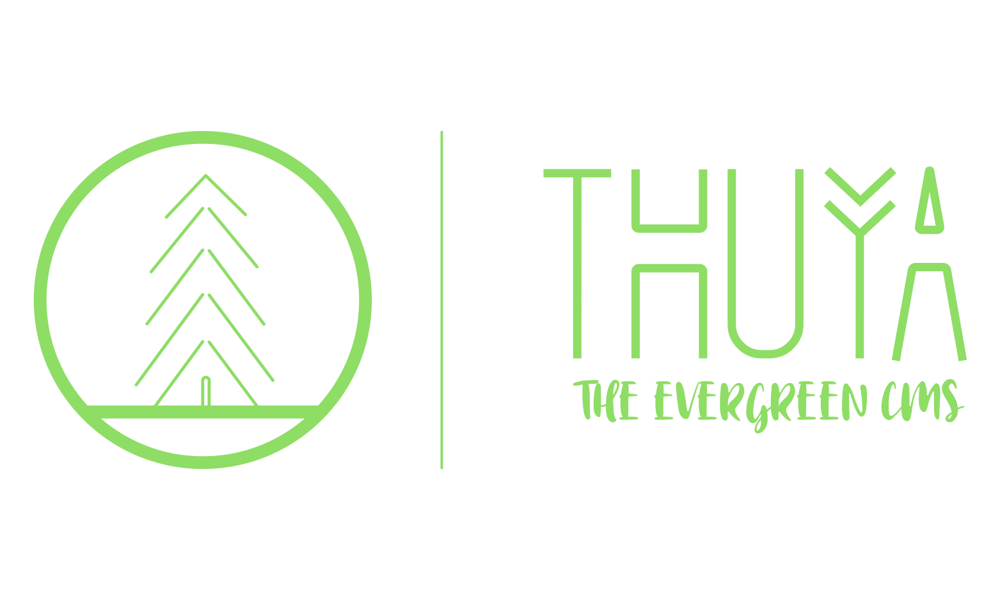

Thuya CMS is an open-source, headless Content Management System based on NodeJS and Express.

## Goals

The goal of Thuya CMS is to simplify backend development. As a result, the target audience is software developers.

With the help of Thuya, it is not required to:

- Write the same authorization or authentication logic again and again
- Create a database connection and implement the persistency just to store some simple data
- Pull large packages where your project uses only a little piece of it
- Read through lengthy documentation about the required JSON or YAML formats to define your content

!!! tip 
    Get started by getting familiar with the [terminology](./basics/terminology/introduction.md).